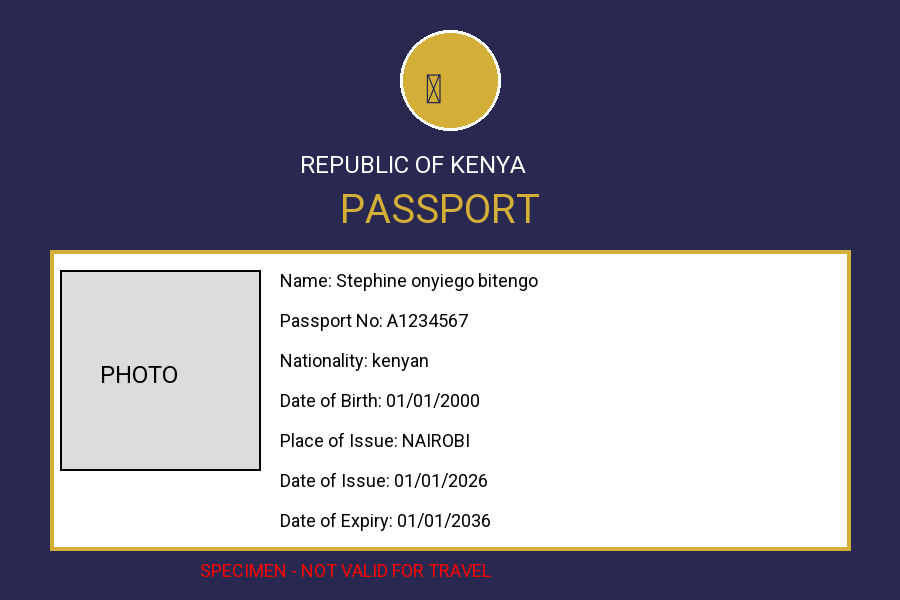

# spaceman-passport
### Pro Passport Generator - Python

A Python project that generates specimen passport documents with multiple country themes, QR codes, and PDF export. Built entirely on mobile with Pydroid3.

## Features
- 3 Country Themes: Kenya, USA, UK
- QR Code generation with passport data
- Export as PNG and PDF
- Photo support
- Customizable fields: Name, Passport No, Nationality, DOB

## Tech Stack
- Python
- Pillow - Image generation
- qrcode - QR Code creation
- fpdf - PDF export

## Sample Output

[Download PDF Sample](passport_A1234567.pdf)

**Note:** This is a specimen project for educational purposes only. Not a valid travel document.
